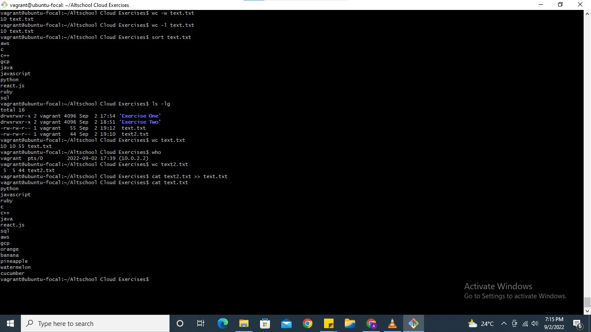
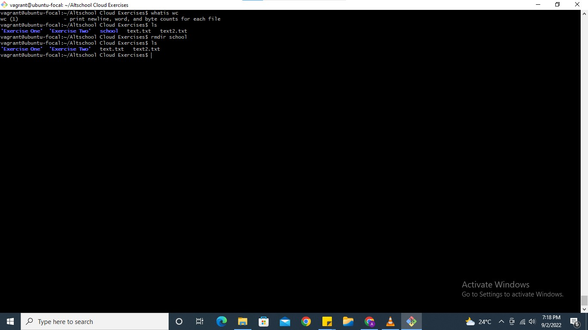

LINUX COMMANDS AND THEIR MEANINGS  
$ wc -w FILE | counts the number of words in a file  
$ wc -l FILE | counts the number of lines in a file  
$ sort FILE | sort contents in a file alphabetically  
$ ls -lg | shows which groups owns the listed files  
$ rmdir DIR | deletes a folder  
$ wc FILE | count the number of lines/words/characters in a file  
$ who | list users currently logged in  
$ cmd < FILE | to take an input from a file  
$ cmd >> FILE | to append output to a file  
$ whatis cmd | brief description of a command

Output one

Output two

